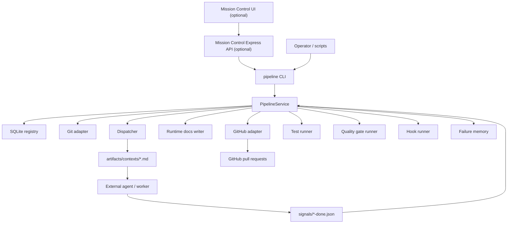
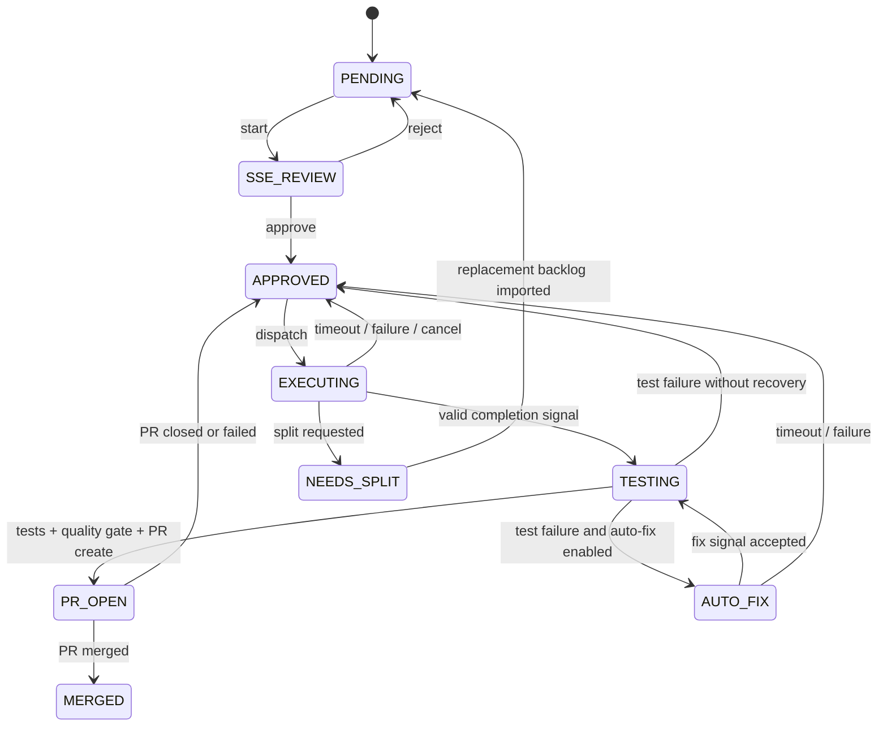

# Architecture

This document explains the **static architecture** of the PIPELINE controller. It complements the controller-managed runtime file at `docs/architecture.md`, which may change during active runs.

## System Context

## Core Components

| Component | File(s) | Responsibility |
| --- | --- | --- |
| CLI | `bin/pipeline.js` | exposes operator commands and JSON/text output |
| Service layer | `lib/service.js` | orchestrates the full lifecycle and coordinates subsystems |
| Registry | `lib/registry.js` | owns slice/feature persistence, display states, metrics, and event logging |
| Runtime store | `lib/runtime-store.js` | handles idempotency keys, leases, run history, and command history |
| Dispatcher | `lib/dispatcher.js` | writes execution context and reads completion signals |
| Test runner | `lib/tests.js` | runs the configured slice test command and stores artifacts |
| Quality gate | `lib/quality-gate.js` | runs configured coverage/mutation commands and stores evidence |
| Git / GitHub adapters | `lib/git.js`, `lib/github.js` | branch creation, push, PR creation, PR status sync |
| Runtime docs | `lib/docs.js` | writes `docs/current-slice.md`, handoff notes, known issues, preflight files |
| Failure memory | `lib/failure-memory.js` | records recoverable failure signatures and reuses successful fix hypotheses |
| Mission Control bridge | `mission-control-source/src/routes/pipeline.js` | shells out to the controller CLI for UI actions |

## Slice Lifecycle

## Data Surfaces

PIPELINE stores or generates state in five main places:

| Surface | Purpose |
| --- | --- |
| `pipeline.db` | authoritative slice, feature, event, run, lease, and command history |
| `signals/` | inbox for worker completion signals |
| `artifacts/contexts/` | generated execution handoff for workers |
| `artifacts/test-results/` and `artifacts/quality-gates/` | evidence for tests and release gates |
| `docs/` | controller-managed operational documents for the active run |

## Import Model

Backlog data is imported from JSON with:

- `project`
- `version`
- `slices[]`
- optional `features[]`

Each slice declares:

- identity and description
- acceptance criteria
- affected files
- dependencies
- agent type and instructions
- optional complexity

Feature groups let the controller run a multi-phase suite only after all of that feature's slices are merged.

## Execution Model

Dispatch is intentionally decoupled from the worker implementation.

### Signal-file mode

In the default model, the controller writes a context file and waits for a signal:

- context file: `artifacts/contexts/<slice>-dispatch.md`
- signal file: `signals/<slice>-done.json`

This is useful when an external agent, script, or human-driven workflow consumes the context asynchronously.

### Command mode

If `pipeline.json` sets `dispatcher.type` to `command` and supplies `dispatcher.command.exec`, the controller can launch the worker directly and still rely on the same signal-processing loop afterward.

## GitHub Boundary

The controller relies on the GitHub CLI rather than direct API code.

That means:

- `gh auth status` must pass for `doctor` and `smoke`
- PR creation and status sync inherit whatever repository and auth context `gh` sees
- the CLI is part of the controller's operational contract

## Failure Memory

When a slice fails and later succeeds, the controller can store a normalized signature of:

- failure type
- reason
- affected files

That signature is used on future retries to preload `docs/fix-hypothesis.md` with a minimal previously successful fix pattern.

This is one of the more interesting parts of the design: the controller is not just tracking workflow state, it is also accumulating repair knowledge.

## Mission Control Design

The bundled Mission Control app is deliberately thin with respect to the pipeline:

1. browser requests hit `mission-control-source/src/routes/pipeline.js`
2. the route spawns `node bin/pipeline.js --json ...`
3. the controller emits JSON
4. the UI renders the response

That keeps the controller usable without the dashboard and makes the CLI the single stable contract.

## Static Docs vs Runtime Docs

Do not confuse these two layers:

- **Static design docs**
  - `README.md`
  - `ARCHITECTURE.md`
  - `SETUP.md`
- **Runtime docs written by the controller**
  - `docs/current-slice.md`
  - `docs/session-handoff.md`
  - `docs/known-issues.md`
  - `docs/architecture.md`
  - `docs/preflight.md`
  - `docs/fix-hypothesis.md`

The runtime docs are part of the controller protocol and may be rewritten during execution.

## Architectural Notes Worth Knowing

- The controller is synchronous and intentionally simple in-process Node.js code.
- SQLite is the single source of truth for slice state.
- Command executions are tracked as first-class records, not just console output.
- The controller uses a lease table to avoid overlapping automated runners.
- The current default configuration is closer to a scaffold/demo setup than a production deployment because the shipped quality-gate scripts are fixtures.
