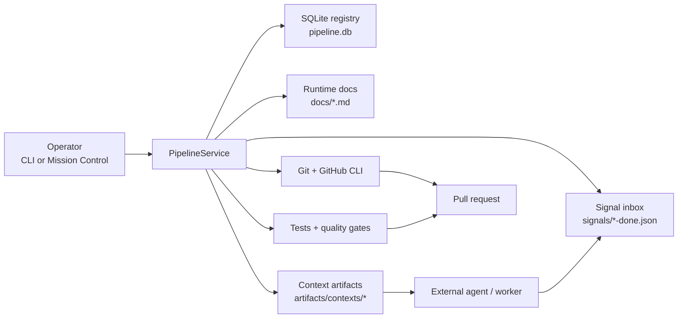

# PIPELINE

[](https://github.com/Therealnickjames/PIPELINE/actions/workflows/controller-ci.yml)
[](https://github.com/Therealnickjames/PIPELINE/actions/workflows/mission-control-ci.yml)

PIPELINE is a slice-based development pipeline controller for running small units of work through a gated delivery loop:

1. import a backlog of slices
2. move a slice through human review
3. dispatch it to an external agent or worker
4. process the completion signal
5. run tests and quality gates
6. open and track a GitHub pull request
7. mark the slice merged and update project memory

This repository also includes an optional web operator surface in [`mission-control-source/`](mission-control-source), which exposes the controller through an Express API and a Mission Control dashboard tab.

## What This Repo Actually Contains

There are two related systems in this workspace:

- **The controller** at the repo root.
  It is a Node.js CLI and service layer that owns state transitions, SQLite persistence, runtime artifacts, Git/GitHub integration, hooks, test orchestration, and failure memory.
- **The Mission Control dashboard** in [`mission-control-source/`](mission-control-source).
  It is an optional UI/backend wrapper that shells out to the controller CLI for pipeline actions and status.

If you only care about automation, the controller is the product.
If you want an operator UI, `mission-control-source` is the add-on.

## What Problem It Solves

PIPELINE is meant for teams that want a lightweight control plane around AI-assisted or semi-automated development work. Instead of letting work happen as an untracked conversation, it turns each slice into a durable record with:

- a status machine
- an event log
- a command/run history
- explicit dependencies
- human approval gates
- deterministic handoff files
- GitHub PR tracking
- post-merge learning via failure memory

## End-To-End Flow



## Repository Map

```text
bin/
  pipeline.js                CLI entrypoint
lib/
  service.js                 orchestration brain
  registry.js                slice/feature persistence and transitions
  runtime-store.js           idempotency, leases, run history, command history
  dispatcher.js              context generation and signal-file dispatch
  git.js / github.js         Git and GitHub adapters
  tests.js / quality-gate.js test orchestration and release gates
scripts/pipeline-quality/
  write-coverage-report.js   fixture coverage writer
  write-mutation-report.js   fixture mutation writer
slices/
  example-slices.json        sample backlog import
docs/
  current-slice.md           controller-managed runtime doc
  session-handoff.md         controller-managed runtime doc
  architecture.md            controller-managed runtime doc
mission-control-source/
  src/routes/pipeline.js     API bridge to the controller CLI
  public/js/components/pipeline-tab.js
                             pipeline dashboard UI
```

## Quick Start

```bash
npm install
node bin/pipeline.js smoke --json
node bin/pipeline.js import slices/example-slices.json
node bin/pipeline.js list
node bin/pipeline.js start SL-001
node bin/pipeline.js approve SL-001 --notes "Ready to run"
node bin/pipeline.js dispatch SL-001
```

When a slice is dispatched, the controller writes a context file under `artifacts/contexts/` and waits for a signal file under `signals/`.

## How The State Machine Works

The main slice lifecycle is:

`PENDING -> SSE_REVIEW -> APPROVED -> EXECUTING -> TESTING -> PR_OPEN -> MERGED`

There are also recovery paths:

- `EXECUTING -> NEEDS_SPLIT`
- `EXECUTING -> APPROVED` on execution failure or cancel
- `TESTING -> AUTO_FIX` when auto-fix is enabled
- `TESTING -> APPROVED` on failed tests without recovery
- `PR_OPEN -> APPROVED` if the PR closes without merging

`SSE_REVIEW` is the human review gate in the codebase. It is effectively the manual operator approval step.

## Mission Control Integration

The bundled dashboard does not talk to the controller internals directly. Instead it:

1. receives browser requests
2. calls an Express route in `mission-control-source`
3. spawns `node bin/pipeline.js --json ...`
4. returns the CLI JSON payload to the UI

That keeps the controller contract simple: the CLI is the API boundary.

## Wiring It Into A Real Repo

The current checked-in `pipeline.json` points `repo_path` at the controller repo itself, which is useful for self-hosting tests but not how you would normally operate a product pipeline.

For real use:

1. point `repo_path` at the repository you want to orchestrate
2. replace the fixture test/quality commands with real project commands
3. choose a dispatcher mode:
   - `signal-file` if an external agent consumes context files and drops completion signals
   - `command` if the controller should launch the worker directly
4. authenticate GitHub CLI with `gh auth login`

Full setup instructions live in [SETUP.md](SETUP.md).

## Important Defaults And Current Gaps

These are important to know before treating the repo as production-ready:

- The default quality-gate commands in [`pipeline.json`](pipeline.json) call fixture scripts in [`scripts/pipeline-quality/`](scripts/pipeline-quality), not real coverage or mutation tooling.
- The checked-in `pipeline.json` is self-referential by default because `repo_path` is `"."`.
- The Mission Control backend assumes a Linux/OpenClaw-style environment for several non-pipeline endpoints.
- The Mission Control pipeline tab can approve, reject, dispatch, and cancel slices, but it does not currently expose `start`, `import`, `process-signals`, or `run`.

## Static Docs vs Runtime Docs

The controller actively writes several files in `docs/` while it runs:

- `docs/current-slice.md`
- `docs/session-handoff.md`
- `docs/known-issues.md`
- `docs/architecture.md`
- `docs/preflight.md`
- `docs/fix-hypothesis.md`

Those are runtime artifacts, not permanent repository documentation.

The GitHub-facing docs added in this repo are:

- [README.md](README.md)
- [ARCHITECTURE.md](ARCHITECTURE.md)
- [SETUP.md](SETUP.md)

## Common CLI Commands

| Command | Purpose |
| --- | --- |
| `node bin/pipeline.js config` | show normalized controller config |
| `node bin/pipeline.js import <file>` | load slices and features |
| `node bin/pipeline.js list` | show slice backlog |
| `node bin/pipeline.js show <id>` | inspect a single slice |
| `node bin/pipeline.js status --validate` | show summary plus runtime validation |
| `node bin/pipeline.js doctor` | run environment checks |
| `node bin/pipeline.js start <id>` | move `PENDING -> SSE_REVIEW` |
| `node bin/pipeline.js approve <id>` | move `SSE_REVIEW -> APPROVED` |
| `node bin/pipeline.js reject <id> --reason "..."` | send slice back to `PENDING` |
| `node bin/pipeline.js dispatch <id>` | create branch, write context, start execution |
| `node bin/pipeline.js process-signals` | process completed worker signals |
| `node bin/pipeline.js pr <id>` | open a PR for a passing slice |
| `node bin/pipeline.js sync <id>` | refresh PR status and detect merge |
| `node bin/pipeline.js run` | execute one automated controller cycle |

## Further Reading

- [ARCHITECTURE.md](ARCHITECTURE.md) for the detailed system design
- [SETUP.md](SETUP.md) for practical wiring and operational instructions
- [`slices/example-slices.json`](slices/example-slices.json) for the import format
