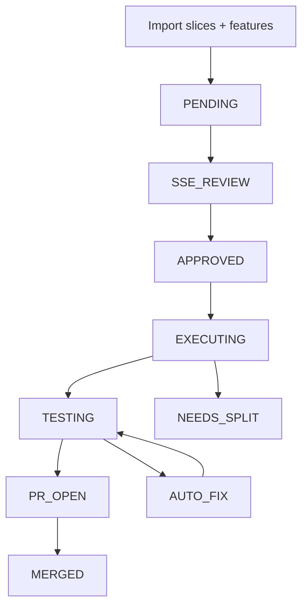

# PIPELINE

[](https://github.com/Therealnickjames/PIPELINE/actions/workflows/controller-ci.yml)
[](https://github.com/Therealnickjames/PIPELINE/actions/workflows/mission-control-ci.yml)
[](https://github.com/Therealnickjames/PIPELINE/actions/workflows/nightly-soak.yml)

PIPELINE is a slice-based control plane for AI-assisted software delivery.

It takes small units of work, moves them through explicit human review, dispatches them to an external worker or agent, runs tests and quality gates, opens GitHub pull requests, and preserves what the system learned along the way.

This repository ships two connected pieces:

- **The controller** at the repo root: a Node.js CLI and service layer that owns the workflow, SQLite state, artifacts, quality gates, PR automation, and failure memory.
- **Mission Control** in [`mission-control-source/`](mission-control-source): an optional web dashboard that shells out to the controller CLI and gives operators a visual surface for the same state machine.

## Why PIPELINE Exists

Most AI-assisted development workflows still happen as loose conversations, ephemeral prompts, or one-off scripts. PIPELINE adds the missing control plane:

- durable slice and feature state in SQLite
- explicit approval gates before execution
- deterministic handoff files for workers
- test, coverage, and mutation quality gates
- GitHub branch and PR automation
- recovery paths like `AUTO_FIX` and `NEEDS_SPLIT`
- post-merge failure memory so successful fixes can be reused later

The design goal is simple: keep the worker flexible, keep the workflow disciplined.

## What The Workflow Looks Like



At runtime, the controller also:

1. writes the active slice handoff into `docs/current-slice.md`
2. generates worker context under `artifacts/contexts/`
3. waits for a completion signal in `signals/`
4. runs basic tests, then coverage + mutation gates
5. opens and tracks the GitHub PR
6. updates run history, artifacts, and failure memory

## What You Get In This Repo

| Area | What it provides |
| --- | --- |
| `bin/pipeline.js` | CLI entrypoint for import, review, dispatch, run-loop, PR, sync, doctor, smoke, and reconciliation commands |
| `lib/` | orchestration, registry, runtime store, dispatcher, docs, hooks, tests, quality gates, GitHub integration, failure memory |
| `pipeline.json` | checked-in controller config scaffold |
| `slices/example-slices.json` | sample backlog import format |
| `mission-control-source/` | Express bridge + browser tab for operators |
| `.github/workflows/` | controller CI, Mission Control CI, and nightly soak |

## Quick Start

```bash
npm install
node bin/pipeline.js smoke --json
node bin/pipeline.js import slices/example-slices.json
node bin/pipeline.js start SL-001
node bin/pipeline.js approve SL-001 --notes "Ready to execute"
node bin/pipeline.js dispatch SL-001
```

If you want the dashboard too:

```bash
cd mission-control-source
npm install
npm start
```

## Use It Against A Real Repo

The checked-in config is intentionally self-contained for testing, not production-ready out of the box.

Before using PIPELINE on a real project:

1. change [`pipeline.json`](pipeline.json) so `repo_path` points at the repository you actually want to orchestrate
2. replace the fixture quality-gate commands with real coverage and mutation commands from that target repo
3. choose a dispatcher mode:
   - `signal-file` if an external worker will consume context files and write signals
   - `command` if the controller should launch the worker directly
4. make sure `gh auth status` succeeds for the target repository

The practical wiring guide lives in [SETUP.md](SETUP.md).

## Current Maturity

PIPELINE is past the prototype stage, but it is still best described as **pilot-ready infrastructure**, not "install anywhere and forget about it" software.

What is already true:

- controller CI is green
- Mission Control CI is green
- nightly soak is green
- the controller has unit tests, fixture integration tests, and end-to-end happy-path coverage
- failure memory and quality gates are integrated into the main workflow

What still depends on your environment:

- `pipeline.json` must be pointed at a real target repo
- the target repo must provide real test, coverage, and mutation commands
- the first serious proof should be a pilot run in the actual worker environment you plan to use

The current release posture is documented in [STATUS.md](STATUS.md).

## Mission Control At A Glance

Mission Control is intentionally thin.

It does **not** own workflow logic itself. Instead it:

1. receives browser actions
2. calls `mission-control-source/src/routes/pipeline.js`
3. spawns `node bin/pipeline.js --json ...`
4. renders the controller JSON response

That keeps the CLI as the stable contract and lets you use the controller with or without the dashboard.

## Documentation

- [SETUP.md](SETUP.md): how to wire PIPELINE into a real repository
- [ARCHITECTURE.md](ARCHITECTURE.md): static system design
- [STATUS.md](STATUS.md): what is proven vs what still needs pilot validation
- [`slices/example-slices.json`](slices/example-slices.json): import format example

## Important Expectations

- The runtime files under [`docs/`](docs/) are controller-managed and may be rewritten during execution.
- The checked-in `pipeline.json` uses scaffolded commands and a self-referential `repo_path`.
- The broader Mission Control app is still Linux/OpenClaw-oriented outside the dedicated pipeline tab.
- The dashboard currently exposes a subset of controller actions; the CLI remains the full operator surface.

## The Short Pitch

If you want a lightweight but explicit way to run AI-assisted engineering work through approval, execution, validation, and GitHub delivery without building a full platform from scratch, this repo is that starting point.
